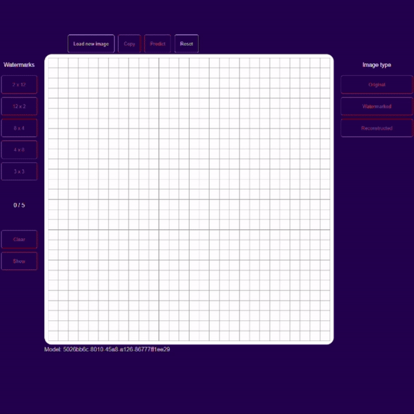

# MNIST Autoencoder

## Quick start
### Dependencies
- Docker Desktop 🐋 

### Step-by-step
1. Download `train.csv` and `test.csv` files from https://www.kaggle.com/code/ngbolin/mnist-dataset-digit-recognizer/input
2. Place both files in `service_backend/data`
3. From project root run `run_linux.sh` or `run_windows.bat` depending on your OS

- Verify api is running at http://localhost:4000
- Verify client is running at http://localhost:4001
- Verify mlflow is running at http://localhost:4002
- Verify data has been successfully migrated (you can use a client like MongoDB Compass):
  - Connection string: `mongodb://localhost:27017/`
  - Db: `MNIST_autoencoder`
  - Collection: `MNIST_train`, `MNIST_test`

4. Train a model via the `/train` endpoint (e.g. using fast API documentation `http://localhost:4000/docs` and the default payload)
    - Investigate logs `docker logs Autoencoder_API --follow`

5. After training finished copy the `experiment_id` from the response or from the MLflow dashboard
6. Go to `client/.env` file and set `VUE_APP_EXPERIMENT_ID=[your copied experiment ID]`
7. Restart the client container:
    - `cd ./client`
    - run `restart_linux.sh` or `restart_windows.bat` depending on your OS

- Verify client uses the right model (see "Model: [Experiemnt_id]" bellow the canvas)

## Architecture

### Common Issue Log: 
Torch doesn't recognize GPU in a container
- Error: CUDA initialization: Unexpected error from cudaGetDeviceCount()
- Context: 'nvidia-smi' and 'nvcc --version' worked, but 'torch.cuda.is_available()' did not.
- Solution: Downgrading Nvidia GPU driver from 556.12 to 552.44
